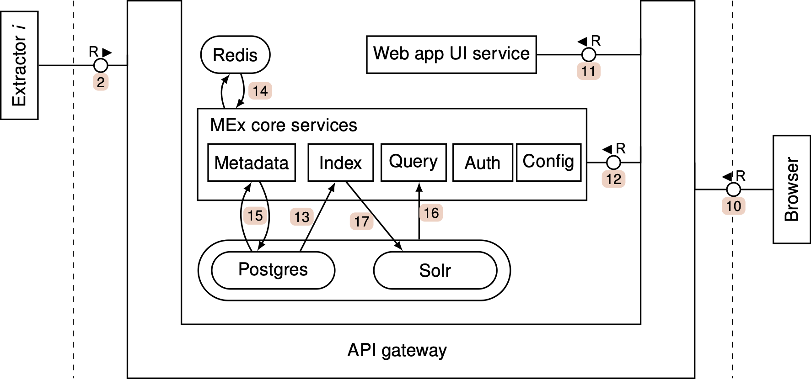

# MEx architecture

We use the [example user session](./what_is_mex.md) to illustrate the main components of a MEx system.

Request 10 represents the requests of the browser to load the web application as well as any requests issued by the web application itself against the backend API.
The API gateway relays the requests to the underlying targets, more specifically the UI service (11) or the metadata core services (12).
The API gateway in a [local setup](./local_setup.md) is an Nginx instance.

The MEx core services consist of five individual services which are responsible for logically separated topics:

- **Config**: Serving configuration and frontend content (field definitions, entity types, search topics, translations)
- **Metadata**: Metadata management (writing, updating, deleting and listing items---basically everything except search and indexing)
- **Query**: Metadata querying where user search requests are executed and the results post-processed.
- **Index**: The service keeps the Solr index in sync with the metadata.
- **Auth**: This service implements a simple authentication logic which may be replaced later by a full-fledged OAuth2 service.

After users navigate to the MEx URL, part of the web app code is returned to the browser~(11) and executed.
It checks for the presence of an access token and in the success case uses it to query the MEx backend subsequently (12)
If it is determined that a (re)authentication is necessary, the web app will redirect to the auth service and commence an OAuth authorization code flow.

When a search is commanded by the user, the corresponding requests flow again via (10) and (12), now reaching the query service where the frontend query parameters are checked and translated to a Solr query.
Executing this Solr query (16) yields the relevant results which are then transformed into the response which is sent back to the frontend.
Even though we assume that all expected queries can be answered by just the data in Solr, we draw the read/write arrows (16) to the storage that contains both the Postgres database and Solr.
This is because we need to enhance the frontend query by constraints derived from the metadata in Postgres before executing it against Solr.
This is necessary to implement a search constrained to only metadata items belonging to a certain organizational subtree.

The data enters Solr in one of two ways: Either when metadata items are written by the extractors (requests (2) or (5)), or when we command an index update procedure during which the index service reads metadata from the Postgres database and writes it to Solr ((13) and (17)).

The metadata service, query service and index service require certain configuration values to function properly.
All configuration is served by the config service.
The configuration consists of a set of JSON files which the config service essentially serves statically.
See [this chapter](./config.md) how to maintain the configuration.
Since configurations change rarely, each service internally caches values for efficiency.
Redis is used by the config service to broadcast configuration changes which leads to core services to purge and refresh their caches (14).

For populating the system with metadata, incoming metadata requests are routed to the corresponding service where it is validated and stored in Postgres (15).
This can happen directly as represented by request (2).
This is the simplest scenario where the extractor does not need any information about existing metadata and also takes care of dealing with network issues (that is, resending requests (2) if necessary).
Clients writing batches of metadata can choose to record status data and logs emitted during this loading as part of a job.
Job state is kept ephemerally in a Redis instance for inspection (14).

<figure>
  
  <figcaption>
    Detailed architecture of MEx.
  </figcaption>
</figure>
