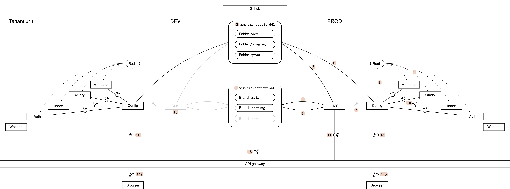
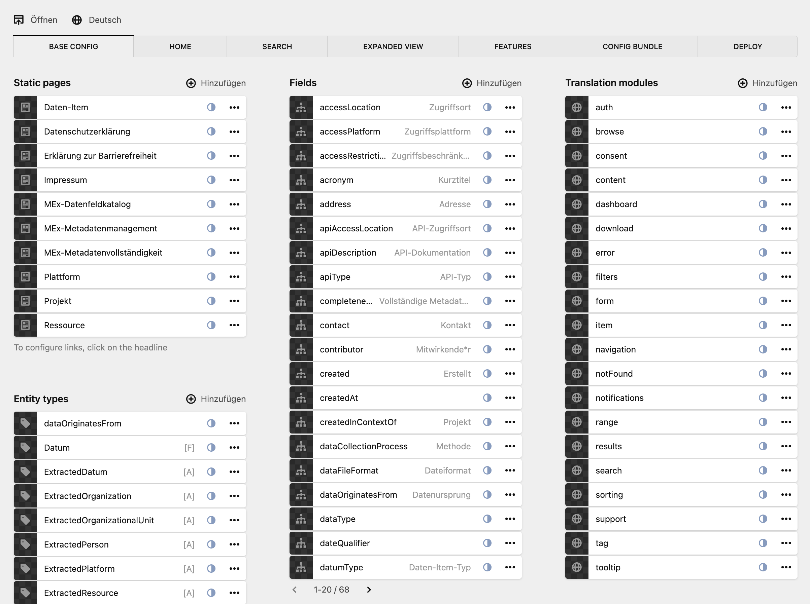
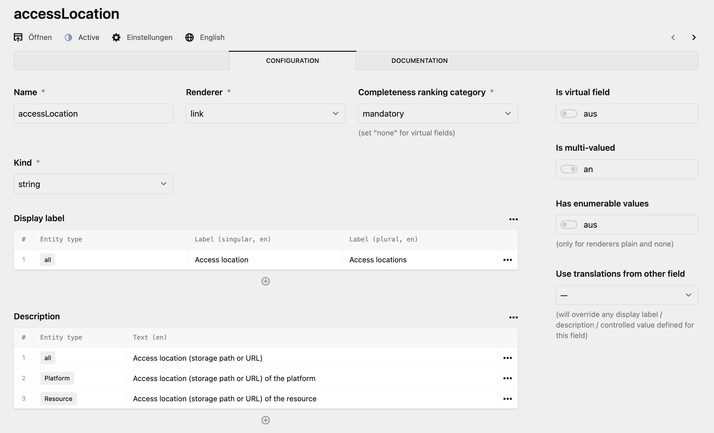
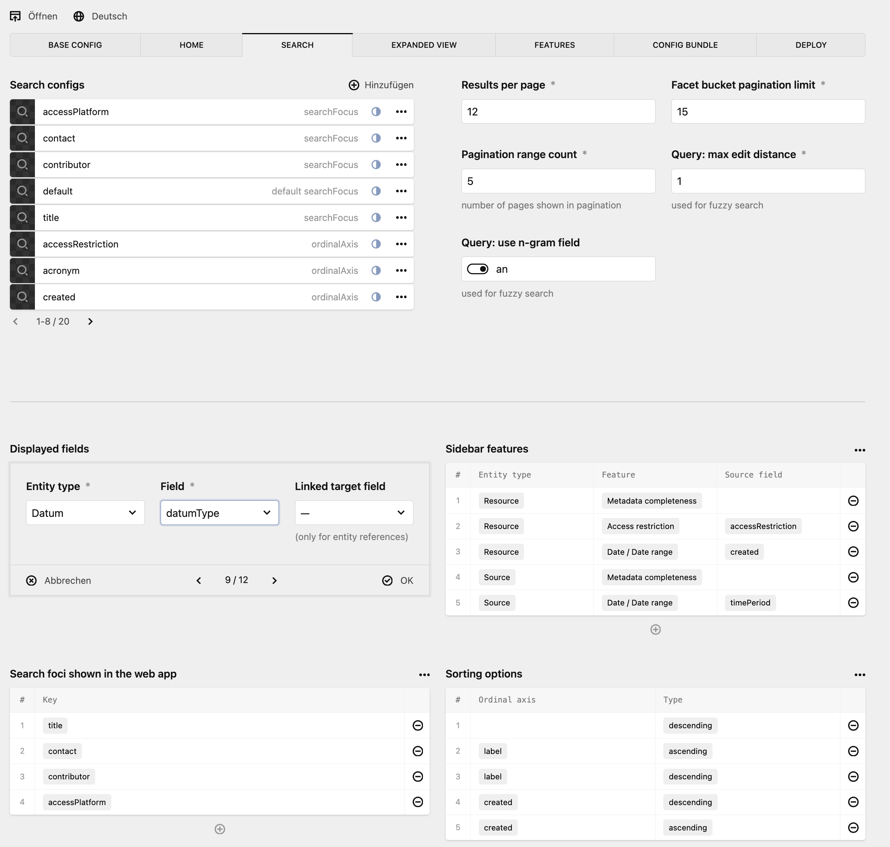
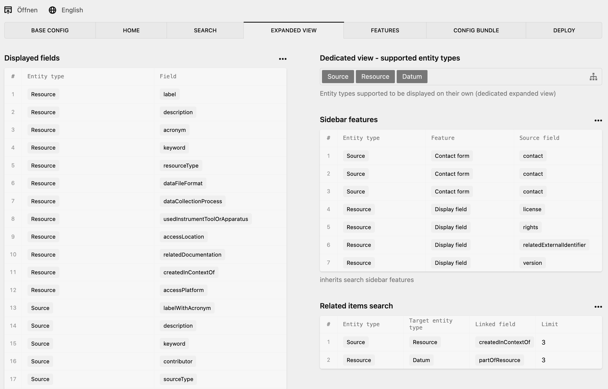

# Configuration

Each core service (metadata, query, index service) gets the relevant configuration parts from the config service's API endpoint `/api/v0/config/files/*` where `*` stands for a path of a JSON file.
(If the path is referring to a folder, the respective `index.json` content is returned.)
Look at the folder `./setup/scenarios/demo/config/test`; all folders and files are part of a configuration.
For example, a request to `/api/v0/config/files/entity_types/organization` will return the content of the file `./setup/scenarios/demo/config/test/entity_types/organization/index.json`.
You can see that the `index.json` of parent folders (like `entity_types`) contains in most cases an array of the data in the sub-folders.
For detailed documentation of the MEx metadata data model and the different configurable aspects of the data model, the search behaviour etc., see the [metadata configuration documentation](./metadata_config.md).

There are two sources from which the config service gets the configuration files:

- In production: The service checks out the files from a Github repository.
- In development and testing: The service has a POST endpoint to which the content of a TAR file can be sent (which contains the folder with all the configuration data).

In either case the question arises how to author and maintain the configuration JSON files, especially as they contain some redundancy.

## Authoring configuration

We recommend using [Kirby CMS](https://getkirby.com/) as an authoring system for the configuration.
Using some Kirby plugins, one can make Kirby emit JSON files instead of HTML content.
For licensing reasons we did not include those plugins (and the Kirby sources) into this repository.

### Kirby setup

Kirby is a file-based content management system, so those sources may also be put into a dedicated Github repository.
That is, the configuration data flow is as follows:

```
Content GitHub repo ---- checkout --------> Kirby CMS service pod
                    ---- static export ---> Kirby CMS service pod
                    ---- commit & push ---> Static GitHub repo
                    ---- checkout --------> Config service
                    ---- GET -------------> Core service
```

The **content** Github repo contains the Kirby files while the **static** Github repo contains the JSON files which represent the MEx configuration.

Figure 1 below shows an architecture diagram of how we use to set up a MEx system with Kirby CMS as the configuration authoring system.

<figure>
  
  <figcaption>
    Figure 1. Configuration setup.
    The CMS offers a web app for users (so-called panel) and RESTful APIs to edit the configuration.
    The data is persisted in a content GitHub repository.
    Upon configuration deployment (a manual step) the configuration is exported and stored in a static GitHub repository.
    From there, the config service will load the static configuration and inform other services to pull the fresh configuration from it.
    Since the data sources for the CMS are GitHub repositories, a single CMS instance can be used to edit the configuration for multiple environments.
  </figcaption>
</figure>

The center part of Figure 1 depicts two GitHub repositories containing the (Kirby) content and the static exports.
A single deployed CMS can manage MEx deployments across cluster boundaries.
In the depicted example, the production CMS (right part) is also used to manage the configuration for the development deployment (left part).
Also, one is free how to organize the GitHub repositories w.r.t. different tenants, environments, and test and preview configurations.
The example shows that tenants are separated on repository level (indicated by the tenant ID `d4l` being part of the repository name).
Inside the content repository (1) there is a branch for each configuration (main vs. testing) and it is assumed in this example that the configurations are identical across environments (development, staging, production).
The static repository (2) shows another way of organizing it: there is a folder for each environments statically exported configuration.

The CMS reads (3) and writes (4) changes to the content repositories when either a user edits the configuration using the CMS panel application or a process uses the RESTful API to change configuration elements.
In order to make a configuration effective in a MEx deployment, the CMS user must export and deploy a configuration which leads to a static export being committed to the static repository (5).
The config service of the targeted deployment is informed (either via (7) if both the config service and the CMS reside in the same environment, or via (11) and (12) in case they do reside in different environments).
The config service reads the static configuration (6) and informs all other services of a configuration change via a Redis broadcast ((8) and (9)).
The individual services will then read the configuration (10) and take respective actions to internalize it.
(This varies from service to service. Some may just invalidate internal caches, others like the index service may recreate the whole Solr index.)

### Kirby example screens

Figures 2 to 5 show some example screens of Kirby CMS with the `demo` configuration.

<figure>
  
  <figcaption>
    Figure 2.
    This is the start screen where you can see the base elements of a MEx configuration (entity types, field definitions, etc.)
    Clicking on an element of a list shows another screen for editing.
    For example, clicking on <i>accessLocation</i> in te <i>Fields</i> list, brings you to the screen of Figure 3.
  </figcaption>
</figure>

<figure>
  
  <figcaption>
    Figure 3.
    This screen shows the details that are configurable for a field definition.
  </figcaption>
</figure>

<figure>
  
  <figcaption>
    Figure 4.
    Configuration screens for adjusting the search behavior and results page.
  </figcaption>
</figure>


<figure>
  
  <figcaption>
    Figure 5.
    Configuration screen to adjusting the metadata item details page behavior.
  </figcaption>
</figure>
