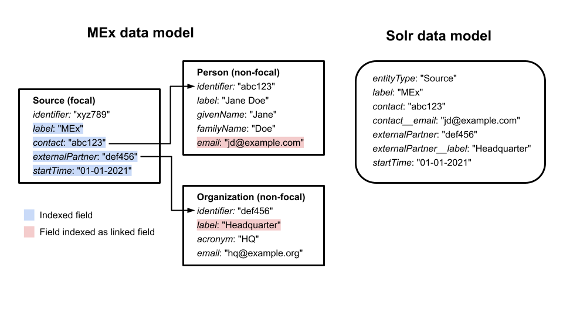
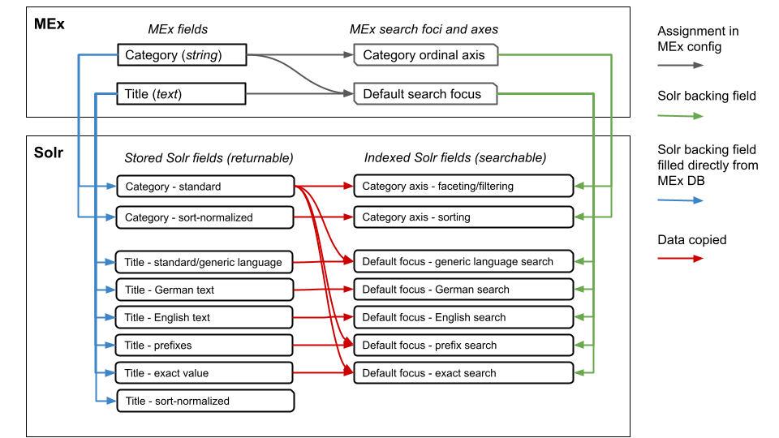

# Metadata configuration

This document gives an overview over the structure of the MEx metadata configuration and how it relates to the data modeling at different points of the metadata lifecycle within MEx.
It starts by describing the different data models used to structure the data at different points of its life-cycle (and thus also at different points in the data flow).
After that, it outlines how to configure storage and retrieval for MEx.
Note that this document does not cover the technical service configuration (which you can read about [on the general configuration documentation page](config.md)).

## Data models used in the MEx system

### Abstract metadata model

The different kinds of metadata abstractly described by a _metadata model_ which organizes the data into entity types (classes), each of which has a set of properties (fields) assigned.
Such models may be specified using e.g. RDF.Properties have unambiguous semantics defined independently of their context of use, so they always have the same semantics in all classes they are assigned to.
A property may be used in several classes or only in one.
Each property has a specific type, e.g. it can hold a number, a text or a reference to another object.
For instance, an instance of the class  `Project` can be related to an instance of the class `Person` via a `contributor` property that refers to a person who contributed to the project.

### MEx data model

The _MEx data model_ defines how MEx structures metadata.
The basic unit of information in the MEx data model is an _item_; each item can contain entries for one or more _fields_.
It provides a concrete way to instantiate the metadata model: an entity instance with a set properties in the metadata model maps to a single item with a set of configured field entries in the MEx data model.
Entities and fields are the core part of the MEx data model configuration.

#### Entities

The entity is the basic data unit.
MEx allow different types of entities to be defined, for representing different data elements (projects, datasets, people etc.).

Each entity type is classified as either _focal_ or _non-focal_:

* _Focal entities_ are entities for which all stored items are indexed in the search index and are hence available for search
* _Non-focal entities_ are entities that are _not_ represented directly in the search index

Which entity types are focal is configured by the client.
Any entity that can show up in the search result list must be focal.

Information from non-focal entities can still be relevant for search and display by virtue of their _relations_ to focal entities.
For instance, suppose we only want to be able to search for and display projects i.e. Project is the only focal entity.
The Project entity contains a field that references a Person, in order to capture who the contact person for the project is.
Users might now want to search for projects using the name of project contact.
To over such use cases, MEx allows properties of linked items to the search index.
For simplicity, only properties of items that are _directly_ referenced from a focal item can be indexed.
Thus, it is possible to enrich a Project item with the data from of a Person entity linked via the `contact` field, but _not_ possible to enrich it with data from an Organization entity to which this Person, in turn, is linked (unless this Organization is also directly linked to the Project).
In cases where a given entity type can link to itself, such recursive links can also only be followed one step.
Details on how to configure indexing of linked information is given below.

MEx entities also differ by whether they trigger aggregation (merging) or not, i.e. whether the information from multiple items might need to be combined to produce new items.
Specifically, if multiple data source (extractors) can send information about a given data object (e.g. a specific project), these need to be merged before being stored in MEx in order to ensure non-redundancy and proper versioning.
Such items thus need to be assigned to an entity type that trigger the appropriate aggregation (see below).

#### Fields

Field have a defined data type and can be single- or multivalued.
Multivalued fields can occur multiple times for a single item (or we can think of the item as storing an array of values for this field).
Each field entry can also be associated with a specific language, to supported target search or language-specific display.
A few fields are pre-defined
Further fields can be freely configured.
For certain field types, the value stored in the field is interpreted as a reference to other item, allowing linking.
See below for details.

### Physical storage model

The physical (DB) data model underlying this general MEx data model is an Entity-Attribute-Value (EAV) model.
It has entries for each item, and each such entry can be associated with an arbitrary number of attached attribute-values pairs, the elements of which are always stored as strings.
This model allow adding and removing field types without modifying the DB structure, making it very flexible.
There is also a storage for relations between items, used when items refers to other items.
Information about the field type properties are stored separately, and the corresponding typing and type-specific logic is handled in the application layer rather than in the DB.
Hence, the physical data model is decoupled from the logic of configuration or data access. 

### Search index (Solr) model

In the current implementation, the search index is handled using [Apache Solr](https://solr.apache.org/).
The search API is independent of the index engines used, but since some configuration details are most easily understood in the concrete Solr context, this discussion will stay in that context.
The _search index data model_ is similar to the MEx data model, but somewhat simpler.
The basic data object is a _document_ which has associated _fields_ which typically (and always in MEx) contain primitive data elements.
A multivalued field can occur multiple times in a document (i.e. form an array of values).
Unlike in the MEx model, there is no way to specify the language of a field entry in Solr  - if such differences are important, each language must use a separate Solr field .

A single metadata model item (of a focal type) is mapped to a single Solr document.
However, unlike the metadata and MEx models, documents are not fundamentally divided into different types - `entityName` is  field like any other to Solr and will not trigger any special logic.
Each document is a flat data structure and the search index itself is also flat in the sense that it is unaware of any linkages between documents.
Hence, to make data from linked entities available, we de-normalize the data when loading it into Solr: documents are structured to directly contain all data needed for display, search etc.
Specifically, Solr documents representing focal items are enriched with the searchable data from linked entities (which may themselves be non-focal or focal).
Suppose, for instance, that we want to enable the search of Project entities based on the email of the contact person or organization.
In that case, a Solr field holding the email of the person/organization would be added.
For each Solr document representing a Project entity, this field would be filled with the emails of any Person or Organization entities linked as a contact.
Note that such a de-normalization implies that any update in entities that are linked to entities stored in Solr must be propagated to _all_ linked documents.
E.g. if the email in a Person entity changes, the Solr documents for each Project entity linked to this person must be updated.

### Data model summary

The basic concepts of the main data models are captured in the table below; the physical data model has been excluded as it irrelevant to what follows.

|                                                          | Metadata model                  | MEx data model                          | Index (Solr) data model                       |
|----------------------------------------------------------|---------------------------------|-----------------------------------------|-----------------------------------------------|
| Instantiated in                                          | Metadata extractors (if at all) | MEx backend                             | MEx Solr service                              |
| Basic data object                                        | class                           | item                                    | document                                      |
| Atomic element in data object                            | property                        | field                                   | field                                         |
| Linkage between data objects                             | reference property              | `link` field                            | none (`link` fields are normal string fields) |
| API using model                                          | -                               | MEx CRUD API                            | Solr API                                      | |
| Atomic elements restricted depending on data object type | yes                             | no                                      | no                                            |
| Hierarchy of data object types                           | possibly                        | no                                      | no                                            |
| Focal entities represented as data objects               | yes                             | yes                                     | yes                                           |
| Non-focal entities represented as data object            | yes                             | mostly, but not e.g. coded concepts     | no                                            |
| De-normalization                                         | none                            | only special cases, e.g. coded concepts | all non-focal data                            |

## Overview of the basic MEx configuration concepts

The key components of the MEx data model - entities and fields - form the core of the MEx configuration.
This configuration involves aspects like the technical type of fields, whether an entity type is focal or not, or whether merging should be applied to a given entity type.

The retrieval of individual items via the MEx CRUD API is fixed by the basic entity and field configuration
The MEx Search API, however, offers further basic functionalities that require their own configuration, specifically _searching_, _sorting_, and _faceting/filtering_ (for details on using the Search API, see the [Search API documentation](../backend/docs/api/search.md))

Faceting refers to the division of search matches into labelled bins (with some items possibly occurring in multiple bins) based on the value in one or more fields.
An example could be the division of returned items based on the associated keywords.
Such facets are displayed as groups (flat or hierarchical) of check boxed in UIs; checking the box restrict the search to the items in the corresponding bin, i.e. filters the data by putting constraints on the fields associated with the facet.

The different MEx configuration elements are compared in the table below.

|                                           | MEx entity types                                                                               | MEx fields                                                             | MEx search configuration                                                                                                     |
|-------------------------------------------|------------------------------------------------------------------------------------------------|------------------------------------------------------------------------|------------------------------------------------------------------------------------------------------------------------------|
| **Definition**                            | Metadata entity types, corresponding to the classes of the metadata model (focal or non-focal) | Metadata fields, corresponding to the properties of the metadata model | MEx concepts tied to specific search functionalities (search foci, faceting, and sorting)                                    |
| **Example**                               | A `Project` entity type                                                                        | An `acronym` field                                                     | A `title` search focus                                                                                                       |
| **Use in metadata loading**               | Defines the entity types that can be sent to MEx                                               | Defines the data fields that can be sent to MEx                        | None                                                                                                                         |
| **Use in MEx UI**                         | Determines which entities can be displayed and which can appear in the search result list      | Organizes the presentation of information (what is shown and where)    | Organizes search and result display (search foci, sort options, and facets)                                                  |
| **Use in MEx backend**                    | Defines possible entity types                                                                  | Defines the stored and returned data fields                            | Defines parameters passed by client for search focus, sorting, and faceting (and hence also the underlying auxiliary fields) |
| **Dependent on underlying search engine** | No                                                                                             | No                                                                     | No                                                                                                                           |
| **Configuration method**                  | Enity type configuration                                                                       | Field configuration                                                    | Search configuration                                                                                                         |

## Concepts of identity in MEx

Consider a typical use case where we use MEx to store the metadata for a scientific data set, say the results of the health survey "SuperHealth Today".
The SuperHealth Today dataset is a well-defined entity outside MEx that persists across time.
As time goes by, this dataset may change (e.g. by adding answers for new survey participants) while still maintaining its identity.
However, we may still want to capture metadata for the SuperHealth Today dataset every time the data changes so that we can track the different versions at the level of the metadata.
If we do so, the result will be several distinct metadata records, each of which represent a different version of the same external data object ( the SuperHealth Today dataset).
The source system for the SuperHealth Today data may not actually store previous versions of the data, so these different version might only exist in MEx.

To capture this is MEx, we correspondingly need two identifiers:

1. An identifier for the individual metadata record (item) within MEx
2. An identifier for the external entity that a given item presents (e.g. the SuperHealth Today dataset in our examples)

We refer to (1) as the _item ID_ and to (2) as the _business ID_.
The item ID must be unique for every item: it is the central internal MEx identifier that allows identifying an item.
It is automatically assigned by MEx upon creation of the item and has no meaning outside MEx.
The business ID, on the other hand, must be assigned by the data source transmitting the data to MEx since only the source can know which external entity a given item represents.
Business IDs are thus often identifiers that are used even outside MEx, e.g. a DOI or other standard dataset identifier.
Those familiar with the FHIR standard for health data exchange might be tempted to think of the business ID as a FHIR `identifier` entry (with an implicit system) and the item ID as the FHIR `id` entry.
However, while that roughly captures the external/internal split, in FHIR different versions of a resource have the same `id` and versions are tracked separately (in the `meta.versionId` element). 

Whereas the item ID is always unique for each item, a single business ID can be used by several items.
For instance, in our example the MEx items representing the different versions of the SuperHealth Today data would have different item IDs, but would all have the same business ID, namely the business ID that identifies the SuperHealth Today dataset.
Indeed, MEx always interprets items with the same business ID as different versions of the same external data object.
MEx uses an "implicit" notion of versions.
That is, items do not carry a version identifier in a dedicated field.
Instead, given a set of items with the same business ID, the individual versions are identified (and can be ordered) by their distinct creation times.

## Configuration of MEx entity types

All configured entities must have a name (`name` field).
Further configuration details are given in the `config` element
This element always contain the element `isFocal`.
It is a flag indicating if the entity is focal (i.e. should be indexed)

Since the business ID is managed as an integral part of every item and exposed via the pre-defined `businessId` field, it is not required to specify a separate dedicated business ID field.
However, for backwards compatibility, it is still possible to store the business ID in a configured field (must be of type `string`).
In that case, the name of this field must be indicated in the element `businessIdFieldName` to ensure that is used as a business ID when e.g. retrieving versions of that it.
If such a custom business ID field is defined and filled in an item to be uploaded, one can leave the `businessId` field empty (it will be filled upon ingestion)  

A simple entity configuration using a custom business ID field thus look like this when serialized to JSON:

```json
{
  "name": "Project",
  "config": {
    "isFocal": false,
    "businessIdFieldName": "identifier"
  }
}
```

### Configuring item merging for an entity type

Sometimes, multiple data source may independently upload items carrying information about the same data object (corresponding to a specific business ID) and may each supply different pieces of information about this object.
In that case, MEx can merge these separate items (referred to as _fragments_) into merged items that contain the combined information.
Usually, fragment entity types are not focal (even if the corresponding merged entity is) since it is rarely required (and potentially confusing) to be able to search individually fragments.

For entity types that need merging to generate the final item for indexing, at least two further elements are needed in the `config` section:

- `aggregationEntityType`: name of the entity type that is the result of the merging process
- `aggregationAlgorithm`: the merge algorithm to use

There are two merge algorithms available, "simple" and "source_partition".
For both, the base set of candidate fragment items to merge together is given by the items of the input entity type that have the same business ID.
When combining entries for given field from different fragments, MEx has no way to tell whether all entries are valid or some should be discarded.
It can at most eliminate identical duplicates of the same value in a given field (see below).
This presents a problem for fields declared as being single valued: if multiple of the fragments being merged have a value in such a field, the merged item will have multiple field entries (unless duplicate elimination is active and fragments always supply the _same_ value).
When merging is being used, it is therefore usually advisable to configure all custom fields to be multivalued and instead deal with multiple entries on the client end.

The business ID of the resulting merged item is generated from the business ID of the input item - currently, this is simply done by appending `#merged` to the ID.
That is, an object generated by merging (a subset of) the items with the business ID `abc123` will have the business ID `abc123#merged`.

#### Simple merge algorithm

This method is the original merge algorithm.
It does not require further configuration parameters, so a configuration would look like this:

```json
{
  "name": "ExtractedProject",
  "config": {
    "isFocal": false,
    "aggregationEntityType": "Project",
    "aggregationAlgorithm": "simple"
  }
}
```

The algorithm proceeds as follows:

1. Collect all items of the input entity type with a given entity ID
2. Partition the items into bins based on the values in all fields of the kind `link` (see below) - that is, create one bin for each unique combination of values in these fields
3. For each bin, pick the most recently uploaded item
4. Merge together the resulting set of items (keeping all duplicates)

The logic is very simple and may not create the desired results for entities with multiple `link` field.
For instance, suppose we write two consecutive versions from the same source of an item, updating a link field that does not related to the source system itself (e.g. a link to the responsible person).
The simple algorithm will then include _both_ versions in the merge since the link target are not all identical.
Hence, the merged item will contain the links to both the most recent _and_ the previously responsible person.
Since it uses all link fields for merging, this algorithm is also slower than the source partitioning algorithm.

#### Source partitioning merge algorithm

The source partitioning algorithm is meant to capture the common use case where the merged item should be generated from the newest versions coming from each source system.
It therefore partitions the data based only on a single field, typically a field that indicates which source system the item came from.
This partitioning field must be indicated in the property `partitionFieldName`.
The source partitioning algorithm also offers more flexibility in the handling of duplicate values within a single field coming from different items being merged: the property `duplicateStrategy` specifies how to handle duplicates values _within a single field_

The source partitioning algorithm proceeds as follows:

1. Collect all items of the input entity type with a given entity ID
2. Partition them into bins based on the value in the field indicated in `partitionFieldName`
3. For each bin, pick the most recently uploaded item
4. Merge together the resulting set of items using the configured duplicate handling strategy

If an item has multiple entries in the partitioning field (step 2), it wil be added to each of the corresponding bins.

There are two duplicate value strategies:

- "keepall": All duplicate values are kept
- "removeall": ALl duplicate values are removed

Thus, suppose we merge to items that both have the field `label`.
The first item has the values `[Title A, Title B]`, the second has `[Title B, Title C]`
.
* With the keepall strategy, the merged item would have the `label`entries `[Title A, Title B, Title B, Title C]`
* With the removeall strategy, the merge result would be `[Title A, Title B, Title C]`.

The removeall strategy will typically be the most natural choice.
However, it can produce misleading results in scenarios where the individual items being merged themselves have duplicate entries _on purpose_.
Thus, with removeall, if one item has `[Jones, Jones]` and another `[Byron]`, the merge result would be `[Jones, Byron]`, eliminating
the deliberate doubling in the first input item.
The keepall strategy will never drop values, but may well output sets of values that make no sense.
For instance, it is pointless to have repetitions in a fields for keywords.

Note that, as noted above, neither of the merge strategies will completely prevent multiple values being written into a field that is configured as being single-valued.
With the removeall strategy, two input items with the same value in a single-valued field will result in a merged item with just one instance in that field (as required).
However, if two input items have _different_ values in a given single-valued field, the merged item will always have both values.

An example configuration is shown below - it bins items based on the value in the `sourcePlatform` field and then merges, removing all value duplicates in the fields.

```json
{
  "name": "ExtractedProject",
  "config": {
    "isFocal": false,
    "businessIdFieldName": "identifier",
    "aggregationEntityType": "Project",
    "aggregationAlgorithm": "source_partition",
    "partitionFieldName": "sourcePlatform",
    "duplicateStrategy": "removeall"
  }
}
```

## Configuration of MEx fields

A field is the basic means for storing data values in an item.
Each field has a fixed semantics independent of its usage.
Hence, we should never configure distinct fields that have the same semantics.
However, if the underlying metadata model has differently named fields with the same meaning in different entity types, we can simulate this in MEx by defining one field for each entity type (with the understanding that the semantics differ by entity type) and then only filling the single relevant field in each item being uploaded.

The metadata model entity type (class) is part of the MEx data model, but MEx does not automatically enforce that entities of a certain type only contain the appropriate fields.

Each MEx field is characterized by a unique name and a technical MEx type called the _kind_. The kind can be one of the following:

- `string`: simple string, treated as a single token and allowing only exact matching
- `number`: number - is technically a floating-point field, but is also used for integers
- `timestamp`: a UTC timestamp in the date format YYYY-MM-DD (e.g. "2021-09-25") or the UTC timestamp format YYYY-MM-DDThh:mm:ssZ (e.g. "2021-09-25:17:46:15Z")
- `text`: a text that should be searchable via free-text search (meaning that language analysis must be done on the field)
- `link`: a reference to another data object, given by the business ID of that object 
- `hierarchy`: a special kind of link field holding an identifier pointing another item that forms part of a pre-defined hierarchy based on parent-child relations between a set of items (a typical example of items forming such a hierarchy are the units in an organization)
- `coding`: A field holding a code drawn from a well-defined terminology, such as the MeSH codes

The names of configured fields must adhere to the following rules:

* must only contain letters, numbers, and underscores (`_`)
* must start with a letter
* must not contain double underscores (`__`)

### Pre-configured standard MEx fields

As noted above, four MEx fields are pre-defined and always present regardless of the configuration created by the user.
They correspond to the information about an item stored in the `items` tables:

In addition, every item has four pre-defined fields which are always present and need not be configured:

1. `id`: The item ID, the unique identifier of the item (same in main MEx storage and search index) - kind `string`
2. `entityName`: The type of entity represented by the item (must be one of the configured entity types) - kind `string`
3. `createdAt`: The time the item entered the main MEx storage - kind `timestamp`
4. `businessId`: The business ID, i.e. identifier for the object that an item is _about_ (i.e. whose metadata it carries) - kind `string`

The field `id` and `createdAt` are automatically filled when the item is first stored in MEx.
The field `businessId` is filled either from the corresponding property directly on the uploaded item or via the value in the field configured to be business ID field for this entity type.
Custom fields cannot have the same name as one of the pre-configured fields.

It is crucial to understand the difference between the two identifier fields `id` and `businessId` - see the section on concepts of identity above for details.
In particular, note that the `id` is unique for each item but that several items can have the same `businessId` (they then represent different versions of the same external entity).

Note that although every item has an entity type, the entity type does not lead to any constraints about which fields can occur in the item.
That is, even if the corresponding metadata model only allows certain properties for a specific class, MEx does not enforce these constraints.

#### Using `link` fields

Fields of kind `link` allow relations between entities.
Such fields are technically string fields but must contain the business ID of the referenced data object.
Since they use the business ID, they represent linkages between the different external entities (say, between a project and an associated dataset) that persist even if those objects are updated.
This typically the most natural notion.
For instance, the relation of being the contact person for a project typically remains even if e.g. the person changes address or the official project description is updated. 
However, it implies that if there are several versions (items) for a given data entity, a reference with the corresponding business ID technically points to all these versions.
In practice, though, we may choose to resolve it to the most recent version.
There is no way to link via an item ID (pre-defined field `id`) and hence no way to point to a unique MEx item (such as a specific version of the metadata for a given business ID).
For those familiar with the FHIR standard for exchanging healthcare data, we might say that MEx works exclusively with logical references (with an implicit code system) and not with literal references, cf. the [documentation of references in FHIR](https://www.hl7.org/fhir/references.html).

### Linked fields: indexing data from linked items

The configured MEx fields correspond to the field of the MEx data model.
However, as discussed above, we sometimes want to be able to find items based not just on their own properties, but also based on the properties of items they _link to_ (via a `link` or `hierarchy` field).
For instance, if a project links to a responsible organization, we may want to be able to find the project by searching for the name of the responsible organization.
To make that possible, extra fields containing the needed information are added in the Solr search index, fields that are not present in the main MEx data store.
We will call such fields _linked fields_ - not to be confused with fields of the kind `link`!

A linked field is specified by two elements:

1. A MEx field of kind `link` or `hierarchy` that points to a target entity via a business ID (the _linking field_)
2. A MEx field on the target entity that should be made available (_target field_)

By analogy to SQL, this is a bit like specifying a table join and selecting a column in the joined table.
The columns to join on are the field given by (1) and the business ID or the target item, the column to be selected is given by (2).

As discussed above, links use business IDs.
Since items that represent different metadata versions of a given external data entity share the same business ID, a link with that business ID points to the set of all these version items.
However, for the purpose of this section we will resolve any such link to the most recent version since the search index only contains the most recent version of each data entity. 
That allows us to think of each link as effectively pointing to a unique item when working with linked fields. 

As an example of a linked field, consider the case of making the email of the contact person/organization for a project (Project entity) searchable:

1. The contact is indicated by the linking field called `contact` which contains the business ID of a `Person`, `Organization`, or `OrganizationalUnit` entity
2. In `Person`, `Organization`, and `OrganizationalUnit` entities, the email is stored in the field `email`

In order to be able to refer to linked fields in the configuration, we use the following naming convention: all linked fields are named according to the schema `X__Y` where `X` is the name of the linking field (1) and `Y` is the name of the target field (2).
To make such conventional names unique, double underscores (`__`) are not allowed in configured field names.
In the above case, the generated field would thus be named `contact__email`.
A linked field name like `X__Y` can be read as paths: _Follow the link in field X and pick up the value in field Y in the target item_.

A linked field has the same MEx kind as the target field.
åThus, in the above example the `contact__email` linked field would be of the kind `string`, like the `email` field.

Note that one and the same target field can occur in multiple different linked fields if is assigned to an entity that is linked from several distinct properties.
Consider the property `label` that is shared by many entities.
`label` might occurs directly on a DataSet items, so it will be a normal field on DataSet items in Solr.
But DataSet might also link to Project items (via the property `createdDuring`), to Platform entities (via `accessPoint`), and to Documentation (via `documentation`).
Hence, on DataSet items the `label` property can give rise to both a simple `label` field and to the linked fields `createdDuring__label`, `accessPoint__label`, and `documentation__label`.
Conversely, we can also define multiple different linked field that are based on the same linking field, but pick up different fields on the target item.
For instance, Project items have both `acronym` and `label` fields, so we can also define the linked fields `createdDuring__acronym` (acronym of associated Project) and `createdDuring__label` (title of associated Project).

An example of the linked field mapping from MEx items to Solr documents for a concrete Project instance is illustrated in the diagram below (for clarity, not all fields actually defined on the entities are shown).



Though linked fields are only "virtual fields" (in the sense that they are not stored in the main MEx data store), they can be used for search foci and ordinal axes (see below) just like normally configured fields.
Note, however, that it rarely makes sense to do faceting using a linked field defined in a hierarchy field.
Firstly, such axes will not be aware of the underlying hierarchy structure.
Secondly, since the objects forming the hierarchy often have labels in all the supported languages, the faceting will show a doubling of facet buckets (each term will lead to multiple language-specific buckets).
The better option here is to facet on a hierarchy axis based directly using the hierarchy field.
That enables hierarchical faceting (i.e. enrichment of the facet buckets with information about their place in the hierarchy) and better management of translated entries.

### Configuration of field indexing

Any field that should be indexed in Solr must contain the `indexDef` property which is an object with two properties.
One property is `multiValued`, a Boolean flag indicating whether the field can occur multiple times in a single data item.
Note that although the value will default to `false`, typically most fields will have this property set to `true`.
Regardless of the value, it is good practice to always explicitly set it for fields that should be indexed, in order to have a non-empty `indexDef` object.

The second property is `ext` (for "extension"), an array of objects that specify configurations that apply only to specific field kinds.
Each object must have a `@type` property which specifies which kind of extension it is.
There are currently three possibly types:

1. `type.googleapis.com/mex.v0.IndexDefExtLink`: Configuration of linking (`link` and `hierarchy` fields)
2. `type.googleapis.com/mex.v0.IndexDefExtHierarchy`: Configuration of associated hierarchy (`hierarchy` fields)
3. `type.googleapis.com/mex.v0.IndexDefExtCoding`: Configuration of underlying code system (`coding` fields)

A valid `link` field configuration must contain a linking extension, and a valid `coding` field must contain a coding extension.
A valid `hierarchy` field must contain both a linking extension and a hierarchy extension (since it both links and has an underlying hierarchy).
Configuration extensions that not relevant to the field type are ignored.
If multiple extension of the same type are given, only the first will be used.

#### Linking configuration

Linking configuration extensions (type `type.googleapis.com/mex.v0.IndexDefExtLink`) must be present in all `link` and `hierarchy` fields.
Apart from the required `@type` property, they have two further optional properties: `relationType` and `linkedTargetFields`.
The field `relationType` specifies the name of the relation between source and target item that should be created when an item with the relevant field is created.
The name can be freely chosen, but should not contain spaces.

The second property, `linkedTargetFields`, is used to configure linked fields (see discussion above).
Using it, we can configure whether fields from the linked entity should be attached to the Solr document for a focal resource with this property.
The fields mentioned in `linkedTargetFields` must be explicitly configured MEx fields themselves and cannot be linked fields themselves.

For instance, to configure the multivalued `link` field called `contact` to lead to the creation of relations with the name "originatesFrom" and to generate a linked field containing the `email` field value from the item references, we would write:

```json
{
  "name": "contact",
  "kind": "link",
  "indexDef": {
    "multiValued": true,
    "ext": [
      {
        "@type": "type.googleapis.com/mex.v0.IndexDefExtLink",
        "relationType": "originatesFrom",
        "linkedTargetFields": ["email"]
      }
    ]
  }
}
```

For this example, the linked field stored in Solr will be named `contact__email` and be of the type `string` (the type of the e-mail field).
Note that we are not required to specify `linkedTargetFields` for every field of kind `link`.
If none is given, the field itself is stored in Solr, but no linked fields are generated.

The above configuration format implies certain restrictions:

1. The linked fields are generated for all focal entity items containing the field, regardless of the entity type. For instance, it is not possible to only generate the `contact__email` linked field on Project items but not on DataSet items if both of them have the `contact` field.
2. The linked fields are generated regardless of the type of the target item (as long as the target field is present). For instance, it is not possible to only generate the `contact__email` linked field if the target is a `Person` item but not if it is an `Organization` item.

These restriction, however, are in line with the general principle that the semantics of a field is independent of the type of the item it occurs in.

#### Hierarchy configuration

A hierarchy configuration extensions (type `type.googleapis.com/mex.v0.IndexDefExtHierarchy`) must be present in all `hierarchy` fields (in addition to a linking extension).
Apart from the `@type` property, the extension contains three fields which define the underlying hierarchy to use:

1. `codeSystemNameOrNodeEntityType`: The entity type of the items making up the hierarchy
2. `linkFieldName`: The name of the field in the hierarchy items that specifies how they are linked to form a hierarchy
3. `displayFieldName`: The field on the hierarchy item that should be used for display

Suppose, for instance, that we have a `hierarchy` field `responsibleOrg` which contains a reference to the organization unit that is responsible for a given item.
The hierarchy of organizational units is made up of items of the type `OrganizationalUnit` and the links that define the hierarchy of those item are given in their `parentUnit` fields.
The name for an organization unit (to be used for display) is stored in the `title` field of the `OrganizationalUnit` items.

Then we would configure the `responsibleOrg` field as follows (recall that we also need to add a link extension):

```json
{
  "name": "responsibleOrg",
  "kind": "hierarchy",
  "indexDef": {
    "multiValued": true,
    "ext": [
      {
        "@type": "type.googleapis.com/mex.v0.IndexDefExtHierarchy",
        "codeSystemNameOrNodeEntityType": "OrganizationalUnit",
        "linkFieldName": "parentUnit",
        "displayFieldName": "title"
      },
      {
        "@type": "type.googleapis.com/mex.v0.IndexDefExtLink",
        "relationType": "relationOwningTeam"
      }
    ]
  }
}
```

In this particular case, we have not defined any linked fields, but we could have done so.
For instance, if we added `"linkedTargetFields": ["title"]` to the link extension, we would generate the linked field `responsibleOrg__title` and could e.g. search for items based on the title of the responsible organizational unit.

#### Coding configuration

Coding configuration extensions (type `type.googleapis.com/mex.v0.IndexDefExtCoding`) must be present in all `coding` fields.
It only contains a single field apart from `@type`, namely `codingsetNames`.
The latter specifies the name of the coding sets to be used for this field (typically, there will only be one).

For instance, to configure a `coding` field to use the 2022 German edition of the MeSH codes (identified, in this particular case, by the name "mesh-de-2022"), we might configure the field as follows:

```json
{
  "name": "meshId",
  "kind": "coding",
  "indexDef": {
    "multiValued": true,
    "ext": [
      {
        "@type": "type.googleapis.com/mex.v0.IndexDefExtCoding",
        "codingsetNames": ["mesh-de-2022"]
      }
    ]
  }
}
```

## Configuration of MEx search-related functionalities

We currently have three configurable search-related functionalities:

1. Search
2. Sorting
3. Faceting & filtering

These are covered by the basic functional MEx concepts associated with the search index:

* **Search focus**: A set of fields to be searched in a specific context
* **Ordinal axis**: A set of fields that can be used for faceting/filtering and sorting in a specific context
* **Hierarchy axis** Similar to an ordinal axis, but enriched with functionality to handle hierarchical faceting and filtering

Each of these concepts is based on defining set of fields, either normal or linked fields (see above).
Since data from non-focal entities is only available in the search index via linked fields, it does not make sense to add fields that are never present directly on focal entities as they would never be filled.
Instead, data from such fields should be accessed via linked fields.

A search focus will typically involve multiple fields that share a common theme, e.g. fields related to people associated with an item (contact person, contributors etc.).
Often, a typical item will have values in multiple of these fields, allowing it tp be matched by any of them.
By contrast, ordinal and hierarchy axes mostly involve only a single field since faceting/filtering and sorting is typically based on a single property shared by all items (say, the time it was created).
However, multi-field axes can be useful for cases where the same (or similar) semantics is encoded in different fields depending on item type, and only one of those fields is ever field in a given item.
For instance, some item types may have a single associated time whereas other have a time _interval_ (but only one or the other).
In that case, to do time-sorting we could create an axis based on the single-time field _and_ the start-of-interval field.

## Architecture of the search index

In MEx, the search index supports both core functionalities (search, faceting, filtering, and sorting) and the provision of basic item information for display directly in the search match list.
The basic item information could in principle also be retrieved separately from the MEx item CRUD API, but serving it from the search index decreases the number of HTTP requests needed, lowering the overall turnaround time
The index architecture therefore needs to support client requirements for both the retrieval and the display of information from MEx fields, as well as associated functionalities like faceting.

When using Solr indices to support these functionalities, MEx uses the strategy of duplicating field data into extra Solr fields optimized for specific actions (e.g. for a specific search focus) and use those for carrying out the searches.
This allows the query logic to be relatively simple and fast (there are fields encapsulating the various actions).
A downside is that it requires a larger search-index, but since Solr is designed to handle very large indices, this is unlikely to be a major issue for normal data load.
It also allows utilizing the Solr-internal logic as much as possible.

The complete Solr index is therefore organized into two distinct parts.

1. Indices for individual MEx fields - we will refer to the corresponding Solr fields as _primary fields_
2. Indices for data associated with a specific search focus or axis - we will refer to the corresponding Solr fields as _auxiliary fields_

This structure is summarized for a simple configuration in the figure below.



The difference between primary and auxiliary Solr fields manifests itself in the generation of Solr queries by the MEx query engine.

* Primary fields are used when specifying what should be _returned_ from the items that match a search (which fields to return or which fields to do match highlighting on)
* Auxiliary fields are used when specifying which Solr field the _operations_ (search, faceting etc.) should be done on - they support what should be _done_ during a search operation.

### Storage of primary fields

How the information from a given MEx field is stored in the Solr index depends on the field type.
In the simplest case, a MEx field simply maps to a single Solr field - this applies to e.g. numeric fields.
However, in many cases, multiple backing Solr fields are needed for various reasons:

* the language of an entry must be captured (requires language-specific fields)
* an alternative form of the field value must be captured, such as the raw timestamp string or a normalized form of the field value to be used for sorting
* further information with which the field value was enriched before indexing must be captured, such as the codes for all parent org units (added to the assigned code to allow finding the item when searching for a parent org unit)

In addition, highlighting requires the stored fields to align with the fields being searched, meaning that the backing fields for MEx text fields must match those backing search foci.
Each MEx field type is therefore associated with specific logic for generating the needed Solr backing fields to be filled when loading data into Solr.
Primary fields are stored in Solr but never added to the actual search indices since they are returned but never used directly for search etc.

#### Normalization of string and text data for sorting purposes

The normalization of data to improve sort behavior is done outside Solr for text and string data.
Such normalization would normally be done inside Solr using field with appropriate, e.g. of the type `ICUCollateionField`.
However, the need to support cross-language sort on multivalued fields proved difficult in Solr, since fields designed for sorting typically do not support multivalued content.
Hence, it was decided to move the normalization out of Solr (it will ideally be moved back once the needed functionality is available).

Currently, the normalization involves the following steps:

1. restricting to the first 1024 characters of the string
2. lowercasing
3. replacing certain characters outside the basic ASCII range with basic ASCII characters

The length-restriction is simply in place to avoid needlessly storing very long strings.
It means that texts that differ only after the 1024th characters may not appear in the correct order - but in such cases, it is unlikely that human users would notice the difference.
Most of the replacements in step 3 involves replacing characters with diacritics with characters with no such modifiers, e.g. replace `é` with `e` or `ñ` with `n`.
These replacements are done in order to give the expected sort order for supported language and as many related languages as possible.
In particular, the German characters `ä`, `ô` , and `ü` are mapped to `a`, `o`, and `u`, respectively, reflecting their sort positions.
Note, however, that this mapping only covers a small subset of characters with diacritics (mainly those used in German, French, and Spanish).
Even if the mapping had been complete, it would be impossible to ensure perfect ordering for every language since language-specific conventions for alphabetic sorting differ (e.g. the letter `å` is sorted differently in Danish and Swedish).
Accordingly, no mappings are given for characters that are known to be sorted differently in different languages.
The mapping also covers a few cases where a single character is replaced by two characters in the basic ASCII range.
Notably, the German `ß` is replaced with `ss` and the French `œ` with `oe`, again with the aim of giving the correct alphabetic sorting.

#### Primary fields for fields of MEx kinds `number` and `link`

For MEx fields of the simple kinds `number` and `link`, each configured field results in a single primary field in Solr.
Primary fields are generated for fields of kind `link` even if they have configured linked fields.
This ensures that the business ID of the linked item is available via Solr.

The type and configuration of the Solr field depends only on the configuration of the corresponding MEx field.
When filling such fields during Solr data load, the value from the MEx DB is simply mapped to this field.
The field is multivalued if and only if the corresponding MEx field is multivalued.
When loading data into Solr, these fields are simply filled with the values from the corresponding MEx fields.
When a client request the field to be returned, the value is drawn from the corresponding Solr field.

Note that `link` fields should not be used in ordinal/hierarchy axes or search foci since their values are merely pointers to other items and typically have no intrinsic meaning.

#### Primary fields for the kind `timestamp`

Date-times are ingested into MEx as strings in one of the following formats:

1. UTC time stamp: "2020-01-01T12:29:45Z"
2. Day-precision: "2020-01-01"
3. Month-precision: "2020-01"
4. Year-precision: "2020"

To allow time-specific operations, a full precision timestamp is generated from all input, choosing the earliest possible time consistent with the given information (e.g. a year-only string is converted to the timestamp for midnight on Jan 01 of that year).
However, the original string representation is also kept in a further backing field to allow display and search.
If the MEx field is configured with the name "someTime", the timestamp backing field will simply be called "someTime" while the raw string field will be called "someTime_raw_value".
Note that this case differ from other uses of multiple backing fields: the extra raw-value field is visible in the sense that it can be requested and retrieved by the client.
In other words, a MEx timestamp field actually acts as _two_ MEx fields: one containing an actual timestamp and one containing a string that can be converted to a timestamp.

#### Primary fields for the kind `string`

To support sorting, MEx string fields are backed not only by a Solr string field holding the stored value, but also a separate field holding a normalized value suitable for sorting.
The normalized value is a transformed version of the raw input that replaces certain special characters to achieve a better alphabetic sorting (see the section on sorting in the [Search API documentation](../backend/docs/api/search.md) for more details)
The underlying fields are multivalued if and only if the corresponding MEx field is multivalued.
When a client request the field to be returned, the value is drawn from the backing field holding the raw value.

#### Primary fields for the kind `text`

The backing fields of the kind `text` are aligned with those for a search focus (see below) since highlighting only works properly when the stored field (in which the highlighting is done) the same type as the field that was actually searched.
In addition, an extra field for normalized content for sorting is generated, yielding the following complete set of fields:

1. Text field optimized for German
2. Text field optimized for English
3. Generic-language text field to handle text in unspecified/unknown/unsupported languages
4. Text field for storing N-grams starting at the beginning of the word (used for prefix search)
5. String field for storing the normalized content (for sorting)
6. String field for storing the exact text without any analysis (for exact search)

Except for the prefix field, all of these fields are multivalued if and only if the corresponding MEx field is multivalued.
Each individual entry in a text field is only stored in exactly one of the fields 1-3 (depending on its language tag) and the two others are left empty.
When a client request a text field to be returned, the content from all language-specific fields (1-3) is combined and returned (this allows content to be returned with language tags).
For highlighting, all fields being used for search are include (meaning all fields except the normalized one is used).

#### Primary fields for the kind `hierarchy`

Fields holding codes need to support actions using both the codes themselves and the corresponding display labels (assumed to generally be available in both English and German).
Accordingly, the following Solr fields are generated:

1. Field for the codes themselves (Solr type `string`, multivalued if and only if the MEx field is)
2. Field for the original code(s) and all parent codes, i.e. the transitive hull of the original codes (Solr type `string`, multivalued)
3. Field for the German display labels of the explicitly given codes and all parent codes (multivalued)
4. Field for the English display labels of the explicitly given codes and all parent codes (multivalued)

When loading data into Solr, field 1 is filled with the original stored code(s), and the parent codes field content (2-4) is generated from it.

When a client request a MEx hierarchy field to be returned, the code itself (1) is returned.
Depending on approach, parent codes and display labels may also be returned.
Highlighting is done on the display labels (3-4).

#### Primary fields for the kind `coding`

The coding fields are similar to the hierarchy ones, but currently do no use enrichment with parent codes.
Accordingly, the following Solr fields are generated:

1. Field for the codes themselves (Solr type `string`, multivalued if and only if the MEx field is)
2. Field for the German display labels of the code (multivalued)
3. Field for the English display labels of the code (multivalued)

When a client request a MEx hierarchy field to be returned, the code itself (1) is returned.
Depending on approach, parent codes and display labels may also be returned.
Highlighting is done on the display labels (3-4).

### Indexing of auxiliary fields

All  functional aspects (e.g. a search focus) are reflected in dedicated fields in Solr.
All such fields are indexed but never stored, since they must support search functionality but are never returned.

#### Auxiliary backing fields for ordinal axes

Ordinal axes must support both faceting/filtering and sorting.
This requires two backing field: one for faceting and filtering, and one for sorting.
The latter needs to be separate since it uses normalized field entries - entries in which special characters are replaced etc. - to ensure an optimal sort (see discussion of sorting in the [Search API documentation](../backend/docs/api/search.md) for more details).
For sorting in situations where a single item either has several values (or none at all) for the ordinal axis, further rules must be defined.
The MEx convention is that when sorting in ascending order, we place an instance according to the lowest axis value attached and put instances where the axis value is absent at the very end.

The type of the backing fields depends on the MEx kinds of the fields included in the axis.

- If all MEx fields in the axis are of kind `timestamp` or type `number`, the auxiliary axis fields will have the same type
- If all MEx fields in the axis have different kind (or mixed kinds), the auxiliary axis field has the Solr type used for sortable strings (e.g. a simple string type)

If the axis has kind `timestamp` or `number`, we can also use an ordinal axis to bin the items according to ranges (range-faceting).

#### Auxiliary backing fields for hierarchical axes

Hierarchical axes are similar to ordinal axes, but require an extra fields for constraining items to the valued actually stored with the item, as opposed to parent codes added during enrichment, which are used for faceting and normal filtering (see the discussion in [Search API documentation](../backend/docs/api/search.md) for details).

The two backing fields used for constraints and faceting are of Solr string type string, the one used for sorting is of the Solr type used for sortable strings.

#### Auxiliary backing fields for search foci

Search foci must support full free-text search, including language-specific matching via stemming (reduction of terms to simplistic "root forms"), prefix-matching, and exact matching for phrase search.
Each search focus is thus backed by different Solr fields with individual analysis logic for supporting these various requirements.
To ensure correct highlighting, the generated fields are the same as those backing a MEx text field (see above), except that there is no field for the normalized field value since a search focus cannot be used for sorting.

## Generation of the Solr index structure

### Basic index construction procedure

MEx provides a base Solr schema in which all Solr field types used by MEx are defined.
Based on the MEx configuration, this base schema is then extended with full set of backing fields needed:

* Primary backing fields for all configured MEx fields
  * Backing fields depends on the field kind, as described above
  * For fields of the kind `link`, backing fields are also generated for any linked fields configured
* Auxiliary backing fields for all functional elements (foci/axes)
  * Backing fields depends on the type of functional element, as described above
* Solr copy fields for copying data between primary and auxiliary backing fields

 ### Wiring logic for connecting stored fields with indexes fields for foci and axes

If a given MEx field is used for a search focus or an ordinal/hierarchy axis, the content of the Solr field backing that field itself must be copied into the appropriate fields backing the focus or axis.
This copy operation is carried out inside Solr using so-called copy-field instructions.
The specification of these copy fields are generated together with rest of the Solr backing fields.

The copy logic depends both on the type of the underlying MEx field and on the functional element (axes/focus) it is used in.
This wiring logic is based on assignments of Solr backing fields to specific categories.
Backing fields for MEx fields are assigned to a category reflecting its role, e.g. the specific language for the field or the fact that it holds a "raw" version of the content.
The generic language category is also the default category, in the sense that it also covers the fields holding the basic field value MEx for strings or numbers fields.

Backing fields for ordinal/hierarchy axes and search foci are assigned a category from a different set of categories that reflect their functional role, e.g. sorting or German-optimized search.
These two sets of category assignments completely determine which fields are copied where for a given functional element type (axis or focus).
For each of the latter, there is a fixed mapping from the MEx field backing field category to one or more functional categories.

A few examples:

* If a MEx `text` field is used in a search focus, all backing fields are copied into the corresponding field for the search axis (except for the normalized backing field)
* For a MEx `coding` field that is part of a search focus, both the German labels are copied into the German-specific, prefix, and exact value focus backing fields.
* If a MEx `string` field is used in an ordinal axis, the normalized content is copied into the sort field for the axis whereas the normal field content is copied into the facet/filter field
* For a MEx `timestamp` field that is part of a specific ordinal axis, the basic timestamp value is copied into both the facet/filter and sort axes

