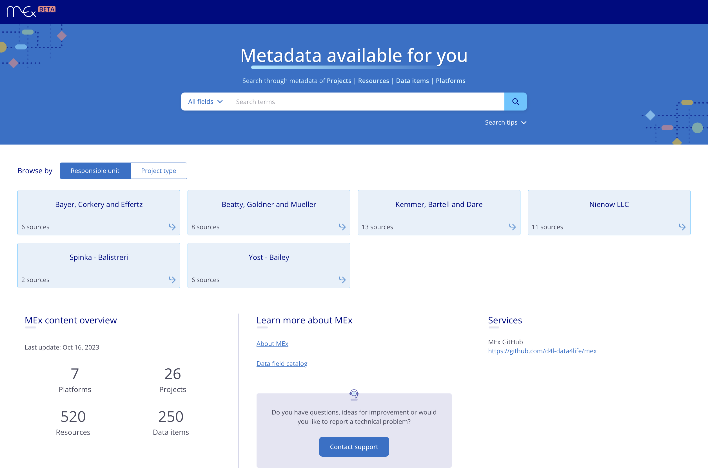
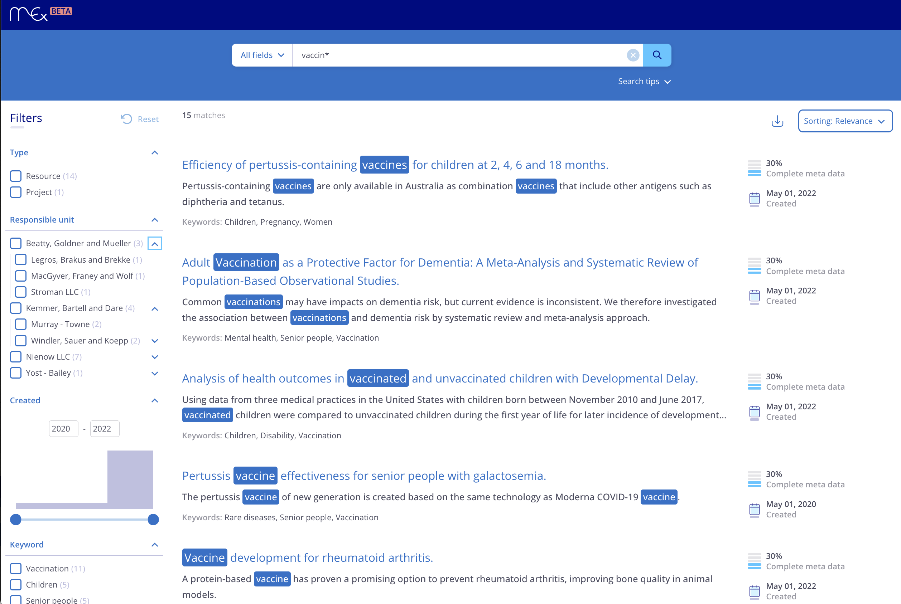
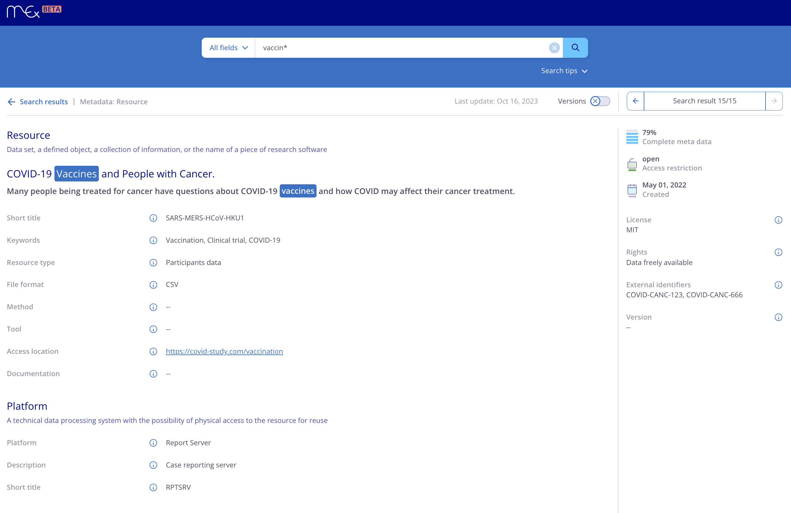

# What is MEx?

MEx is a repository that enables research data reuse by making data findable, accessible and exchangeable through their metadata.
MEx combines metadata (about research data sets) from different sources and expose a common query interface on it.
The original data is not stored by MEx!
Typically, custom extractor programs run at a regular cadence, extract relevant metadata from those source systems and send them to MEx.
The received metadata is indexed and stored so that it can be searched using structured and unstructured (free-text) queries.

## A typical user session

This section illustrates an exemplary user session of MEx by a consumer user.
The user browses to the MEx URL, the web app loads and presents a welcome screen as illustrated in Figure 1.
This welcome screen contains tiles showing statistics or search results of predefined queries.
Furthermore, the screen contains a free-text search field where the user can enter a search query.
Executing such a search will navigate to the results screen as shown in Figure 2.

<figure>
  
  <figcaption>
    Figure 1. The welcome screen. It contains a free-text search field at the top and tiles showing results of predefined queries at the bottom.
  </figcaption>
</figure>

The main part of the results screen contains a list of result previews ordered by rank (or any available criterion selected by the user).
Each element of the results preview contains values of fields of the metadata item that was found.
The screen also shows a collection of criteria which can be used to further refine the query.
That is, selecting additional criteria will command a new search with those criteria added.
This feature is known as _facetting_.

<figure>
  
  <figcaption>
    Figure 2. The results preview screen.
    The list shows ordered result previews which the user can click to proceed to a details screen (see Figure 3 below).
    The left shows a collection of criteria that the user can select to refine the current search results (known as facetting). Also, different order criteria can be selected here.
  </figcaption>
</figure>

When clicking on a preview in the results list the app shows the details screen of the selected item as shown in Figure 3.
This screen shows the full set of values of all fields of the selected metadata item.
It may also contain links to other related metadata items.

<figure>
  
  <figcaption>
    Figure 3. The details screen is shown when a preview of the results list is selected.
    It shows all field values of the metadata item and possibly links to related metadata items.
  </figcaption>
</figure>
